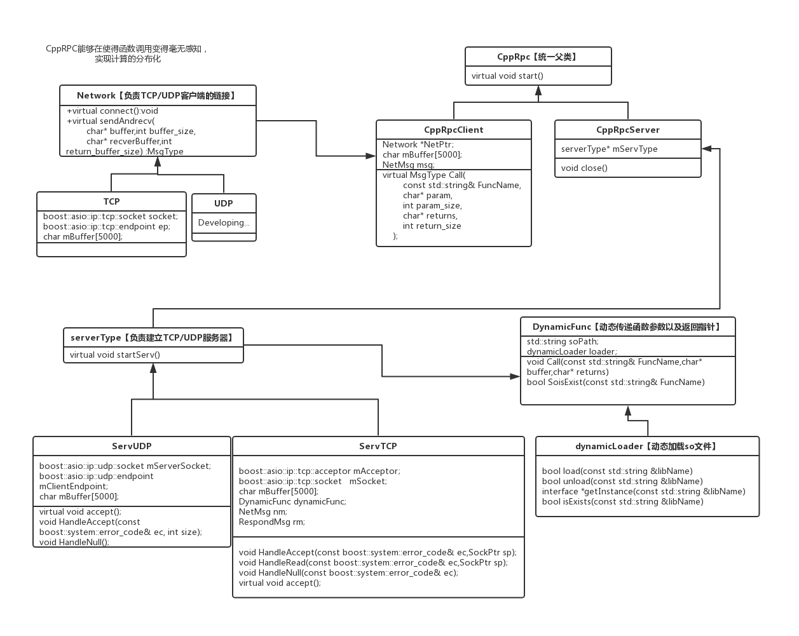

# CppRpc远程调用框架【基于BOOST 1.58 asio & gcc 9.2.1】  
#a flexible framework written by cpp that used to make rpc more easily. It made by stratagy and observer design mode  

>CppRpc框架示意图  
>
 
使用前请git clone 我的CppdynamicLoad项目到本文件夹覆盖  
构建sample方法:  
构建服务器：make  
构建客户端: make rpcclient  
  
若要重新构建so，请在CppDynamicLoad中执行：make so  
随后，先打开服务器，./Server,默认端口号为40232  
然后打开客户端即可自动连接, ./rc  
输入指令 add 1 2 回车，即可访问到服务器的add函数,执行加法运算    
输入指令 mul 4 5 回车，即可访问到服务器的MUL函数,执行乘法运算  

